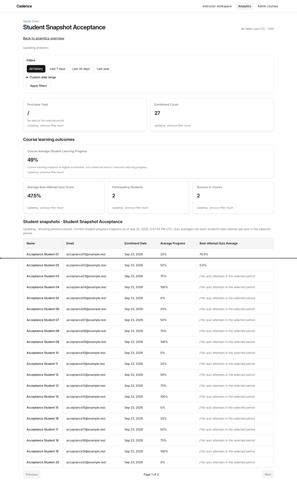
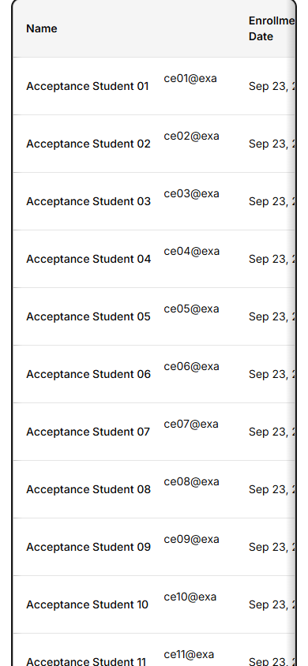

# Issue #8 verification

Date: 2026-09-25 (Asia/Shanghai)

Implementation branch: `codex/issue-8-student-snapshot`.
Comparison base: `fa7fc09260b744d2b21de8081db4a170080014ac`, including PRs #9 and #10.

## Automated verification

- Full Vitest: 28 files, 470 tests passed after adding scoped student-column recovery.
- `pnpm typecheck` passed.
- Prettier check and `git diff --check` passed.
- Final error explanation/inline Updating wording: 19 relevant UI tests passed.
- SQLite service coverage includes authorization, explicit-only student identity, period-first enrollment deduplication, earliest eligible date, stable 20-row pagination, deleted enrollments, best attempts, empty/unavailable/error states and isolated metric retry.
- Loader coverage includes session, URL page validation, scope, PII exclusion and retry response identity.

## Code review

Independent Standards and Spec reviews compared the implementation with the base above.

### Standards

The reviewer noted a literal ambiguity in the testing standard's database-mocking rule for a pure static-rendering component test. The PRD explicitly defines static UI rendering as a separate seam; no unused SQLite fixture was added. Optional duplication between the existing single-student quiz helper and the new batch calculation was noted; no correctness issue was found, and a broader legacy refactor was deferred.

### Spec

The initial review found student-row metric errors lacked recovery and announcements. A scoped, read-only retry endpoint now recalculates only the requested column, rechecks authorization and current membership, preserves sibling observations and reports a separate timestamp through the existing single live region. Follow-up review confirmed this behavior and requested a safe read-failure explanation and column-local Updating text; both were added.

## Browser verification

Headless Chromium against the isolated development database, desktop and 390px mobile:

- All-history pagination returned 20 then 7 students; recent-period pagination returned 20 then 6 because a recent duplicate enrollment makes the older student eligible after period filtering.
- Changing periods reset student pagination; explicit custom dates persisted through paging.
- Real zero, missing attempts and rounded progress/quiz values were visibly distinct.
- One live region; delayed navigation preserved same-course rows with Updating and disabled conflicting controls.
- Pending cross-course navigation and unauthorized responses hid student identity.
- Mobile document did not overflow; the table scrolled horizontally. Hint appeared only after viewport entry and disappeared after scrolling; Name stayed fixed with a visible boundary, keyboard arrows scrolled, and focus had a visible outline.
- Retry recovered the failed column through the real endpoint without whole-page revalidation; quiz values and initial timestamp stayed unchanged. Repeated failure remained recoverable. Changed membership and denied access hid the roster and required reload.
- No browser page errors were observed.

Evidence and repeatable local browser scripts are outside the repository at `E:/analytics-worktrees/issue-8-acceptance`.

The user confirmed human acceptance passed on 2026-09-25 and authorized creating the Issue #8 PR without merging. No separate screen-reader listening result was supplied. Keyboard pagination currently returns focus to the document body/top after navigation, recorded as a UX observation. Issue #8 remains open until the PR is reviewed and merged.

Publication-time verification reran the full suite (28 files, 470 tests) and typecheck successfully.

### Screenshots

These screenshots use synthetic acceptance students in the isolated local database.

## Manual entry

Local server: `http://127.0.0.1:4178/instructor/analytics/3`.
Email-only login: `sarah.chen@ralph.dev`.
The new worktree's database was confirmed absent before seeding. Existing worktree databases and original working changes were not modified.
